# 09Room(NestJS Website)

### Intro.

---

`연구방` 동아리 웹사이트 제작 프로젝트

---

### Development & Framework & Library

---

- SSR: Front(`handlebars` & `bootstrap`), Back(`nestjs` & `nodejs` & `express`)
- DB: `MongoDB Atlas` & `mongoose`
- Module & Controller & Service & Repository Pattern + View
- REST API: `method-override`

### Function & Library

---

- 화면구성(`bootstrap` & `wow`)
- 회원가입 & 로그인 & 로그아웃(`bcrypt` & `cookie & session & jwt`)
- 입력 유효성 검사(`class-validator`)
- 회원가입 인증 메일 발송 & 인증여부(`nodemailer` & `naver smtp`)
- 플래쉬 메시지(`connect-flash`)
- 인증(Authentication)과 권한(Authorization)
- 게시물 작성 편집 삭제(`CRUD`)
- 게시글 Pagination
- 카카오 맵 & 로드뷰

# Site Pages

## 목록

---

- 홈
  - `bootstrap`: 기본적인 grid와 component 구성
  - `wow`: fade-in, fade-out, pop-up 효과

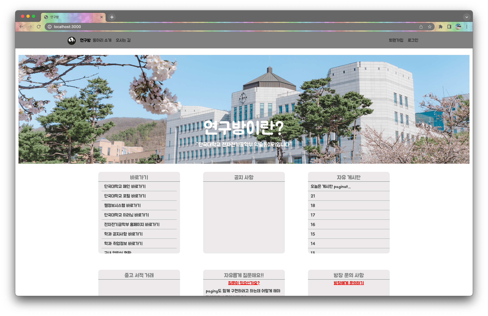

---

- 회원 가입
  - `class-validator`: 입력 유효성 테스트
  - pk(학번) 중복 검사
  - `connect-flash`: 유저 피드백(플래쉬 메시지)

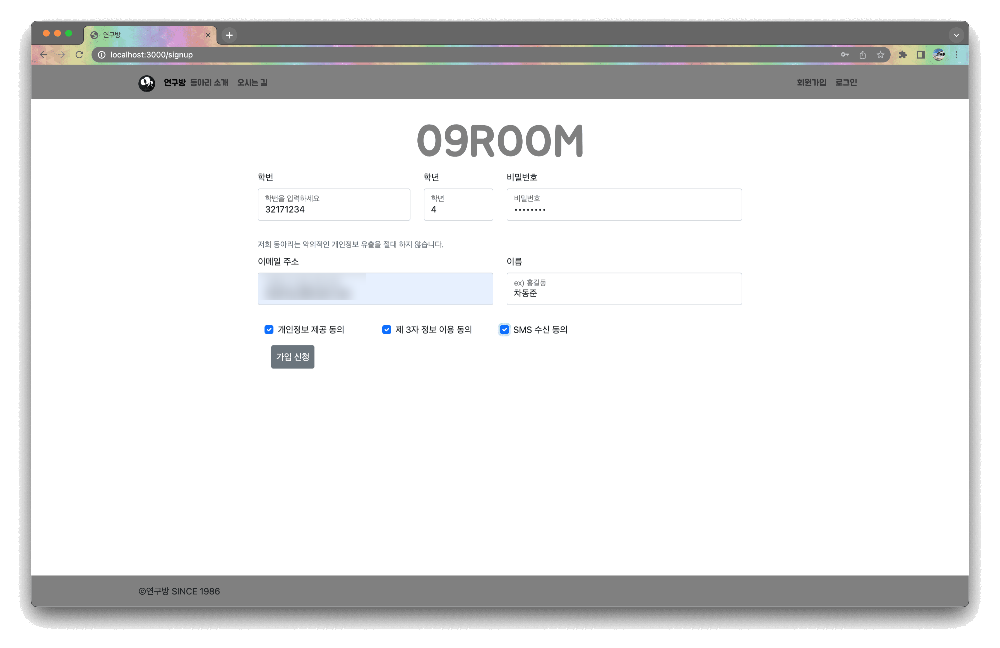

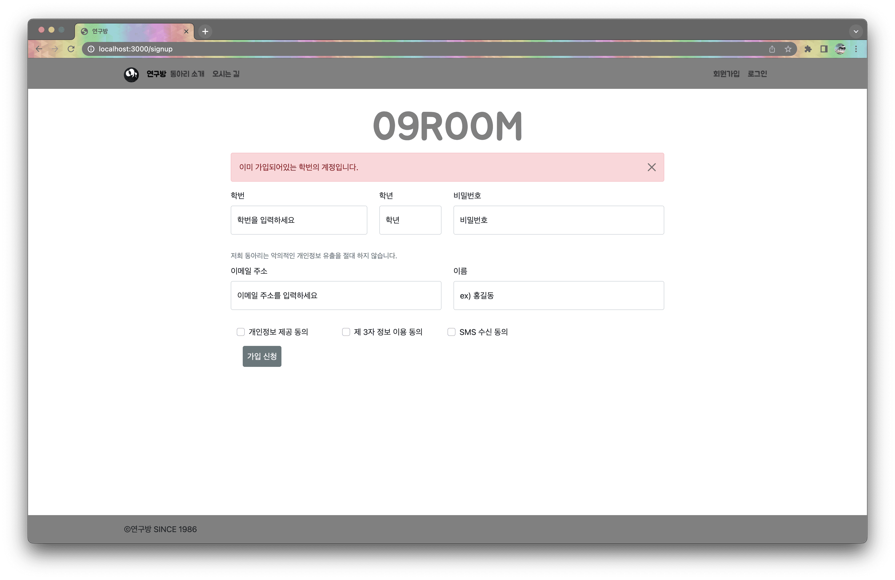

---

- 이메일 인증
  - `nodemalier`: naver의 smtp를 사용한 인증 메일 발송

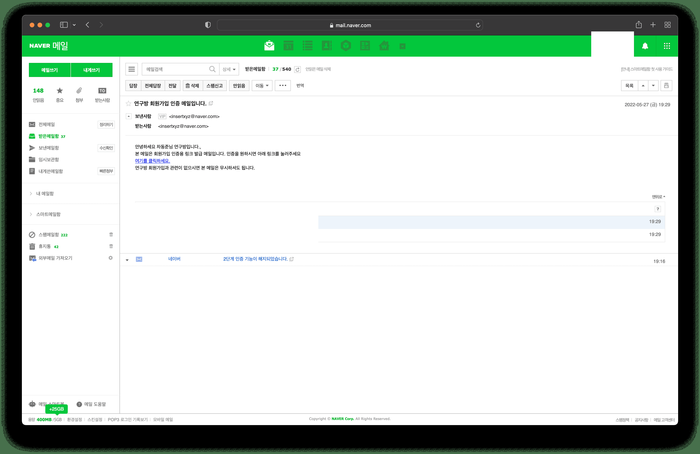

---

- 로그인
  - 잘못된 정보 입력시 유저 피드백
  - 로그인 성공시 홈 상단에 username으로 간단한 인사말 추가

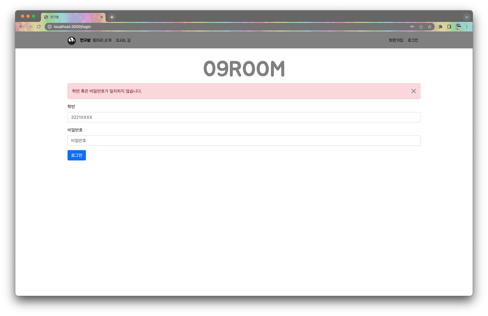

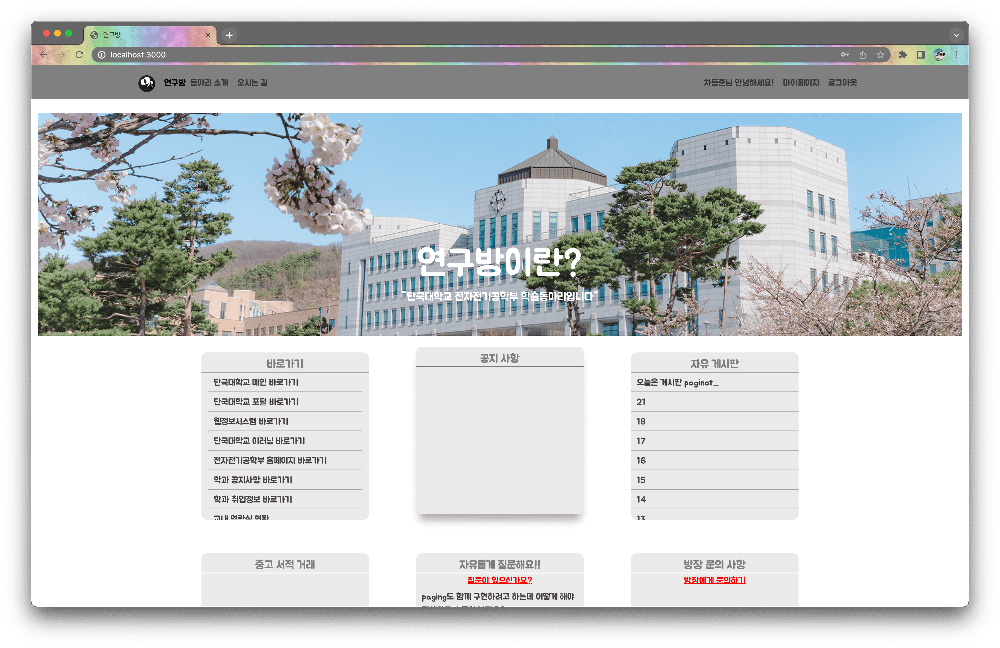

---

- 회원 정보 수정

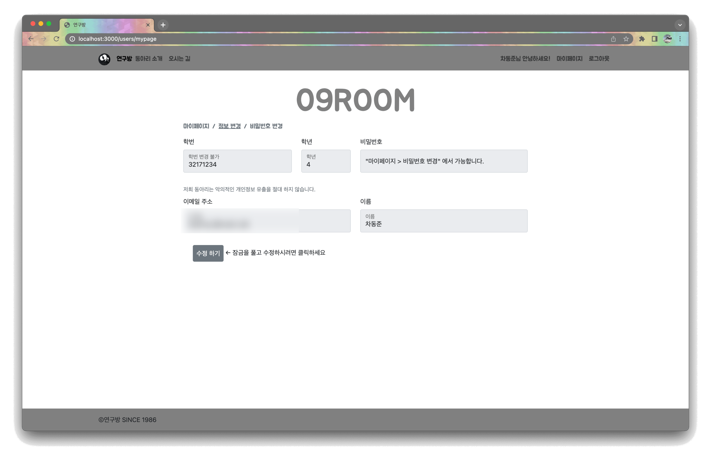

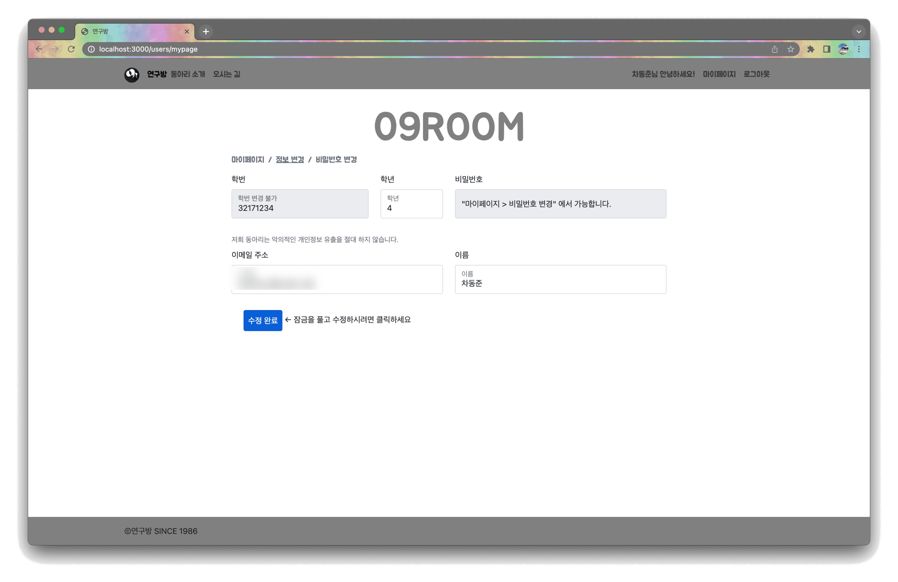

---

- 비밀번호 변경

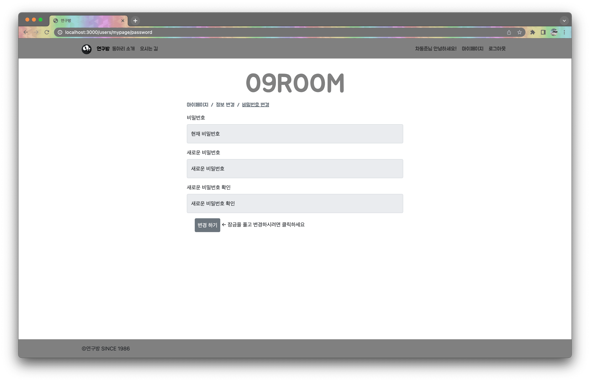

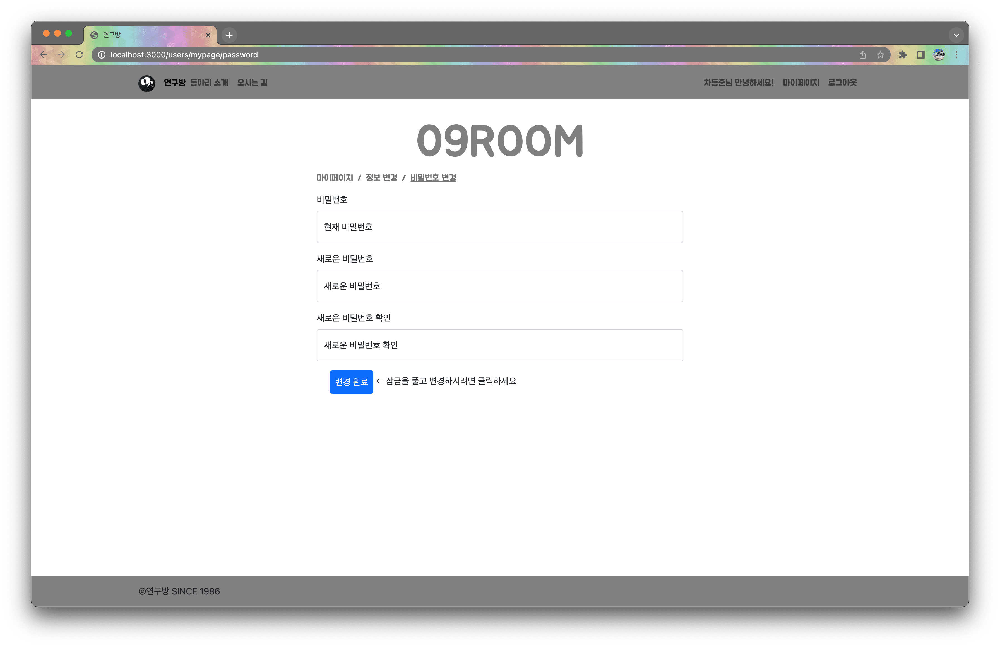

---

- 게시판
  - 조회수 & 작성일시 구현
  - 작성자 정보 미공개
  - Pagination

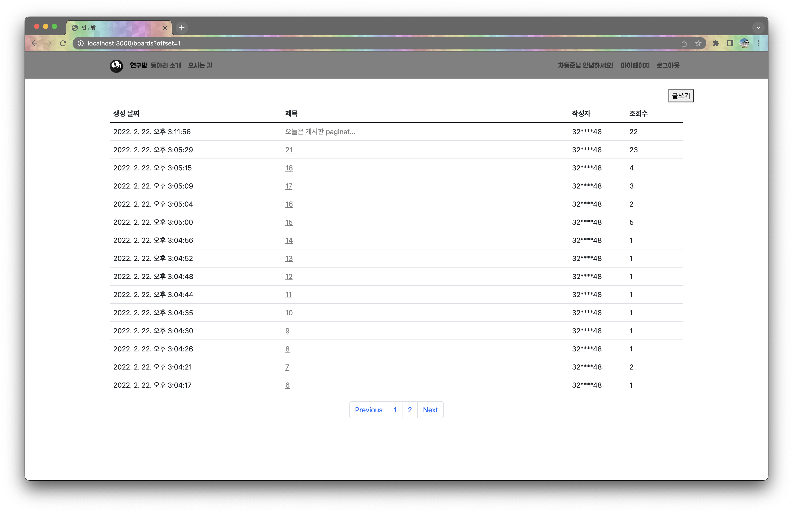

---

- 카카오 맵 & 로드뷰

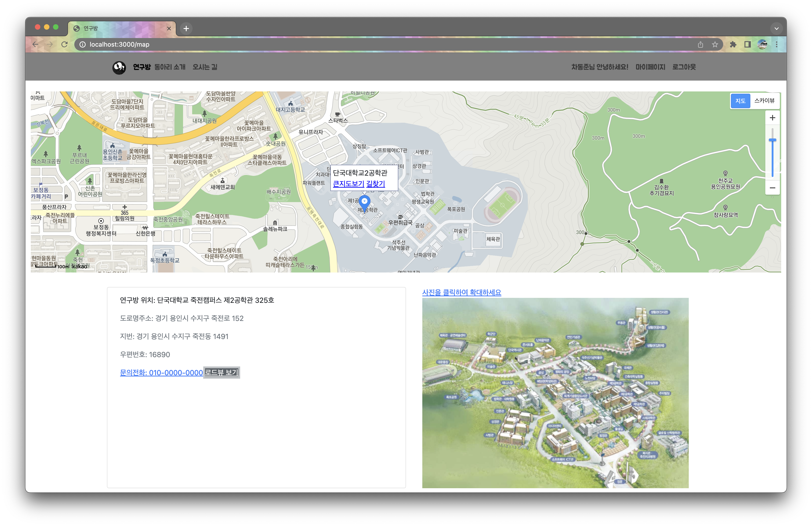

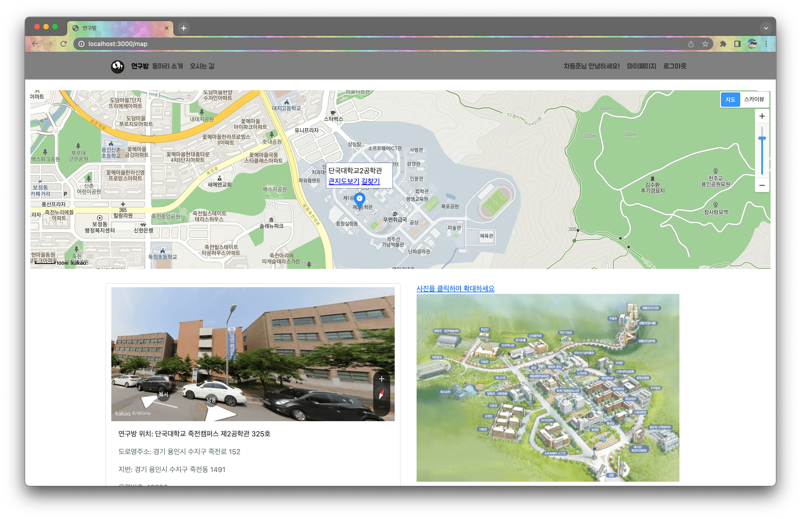
